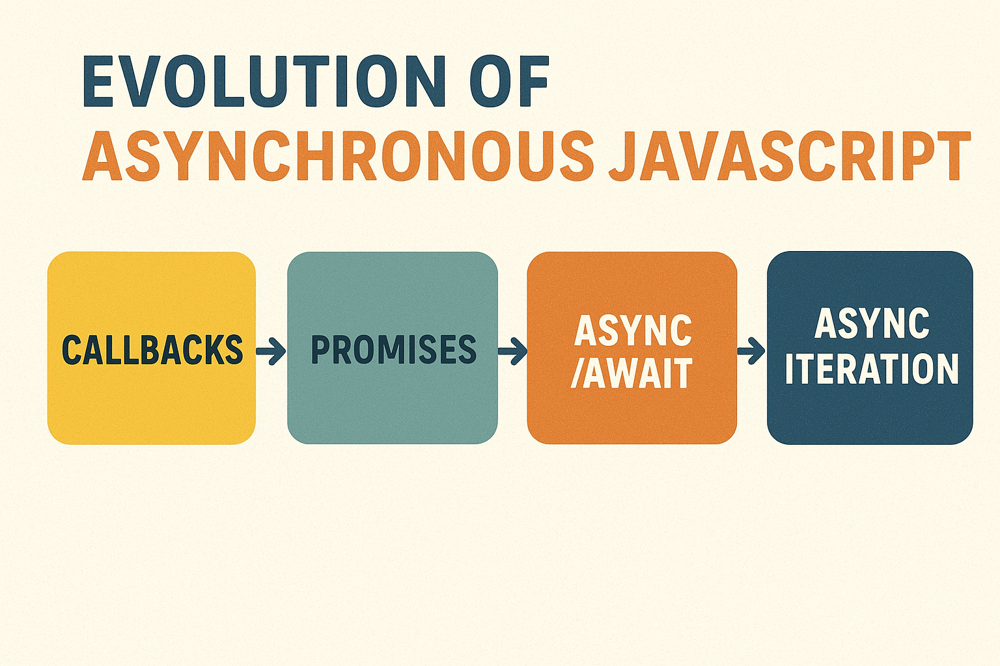

## Asynchronous 

- **Asynchronous**
     JavaScript is a programming paradigm that allows you to execute tasks concurrently, without blocking the main thread. 
     
     In a typical synchronous JavaScript model, each task is executed one after the other, and if one task takes a long time (like reading from a file or making a network
     
     Asynchronous JavaScript helps solve this problem by allowing tasks to run in the background, letting the main thread continue executing other code.
     
&nbsp;

### ***Progress of asynchronous JS***

&nbsp;

- ### Key concepts in asynchronous JavaScript includes: 
    
    - #### **Callbacks (Since inception):**
        - Functions passed as arguments to other functions, to be executed after the completion of an asynchronous operation. 
        - This was an early approach to handling asynchronous code, but can lead to "callback hell" (nested, hard-to-read code) in complex scenarios.
        - Problems of `Callback-Hell` (chain multiple callbacks together)

    ---

    - #### **Promises (ES6):**
        - Objects representing the eventual completion (or failure) of an asynchronous operation, and its resulting value. 
        - Promises provide a more structured way to handle asynchronous operations and chain multiple asynchronous tasks together using `.then()` for success and `.catch()` for errors.
        - **Once settled** (fulfilled or rejected), a Promise cannot change state. `.finally()`

        ---
        
        - ***States of a Promise:***

            - ***⏳ Pending*** – Initial state, neither fulfilled nor rejected.

            - ***✅ Fulfilled (Resolved)*** – The operation completed successfully, and you have a result. `.then()`

            - ***❌ Rejected*** – The operation failed, and you have an error reason. `.catch()`

        ---

        - ***Promise Utility Functions:***

            - **`Promise.all([p1, p2, ...])`** Waits for all to resolve (or rejects if any fail).

            - **`Promise.race([p1, p2, ...]))`** Returns the first settled promise (fulfilled or rejected).

            - **`Promise.allSettled([p1, p2, ...])`** Waits for all promises and gives results for each (success or failure).

            - **`Promise.all([p1, p2, ...])`** Returns the first fulfilled promise (ignores rejections unless all reject).

    ---

    - #### **Generators (ES6):**
        - Generator functions are defined using an asterisk `(*)` placed after the function keyword.
        - Asynchronous generators in JavaScript combine the features of asynchronous functions and regular generators, enabling the creation of iterable sequences where each value can be produced asynchronously.
        - When we invoke the next() function, it yields an object comprising two properties:
            - **Value** This signifies the actual value of the object at the current iterator position
            - **Done** This Boolean state indicates whether the iteration is complete or not.
            - ***Eg:***  `{value: id, done: false|true}`

        - This helps with many applications: iterators, asynchronous programming, etc.
        - ***Roles played by generators:***
            
            - ***Iterators (data producers):***
                Each yield can return a value via next(), which means that generators can produce sequences of values via loops and recursion. Due to generator objects implementing the interface Iterable, these sequences can be processed by any ES6 construct that supports iterables. Two examples are: for-of loops and the spread operator `(...)`.

            - ***Observers (data consumers):***
                yield can also receive a value from `next()` (via a parameter). That means that generators become data consumers that pause until a new value is pushed into them via `next()`.

            - ***Coroutines (data producers and consumers):***
                Given that generators are pausable and can be both data producers and data consumers, not much work is needed to turn them into coroutines (multi-tasks).

    ---

    - #### **Async/Await (ES7) :**
        - Works with `async` & `await` keyword.
        - `async` is a keyword that is used to declare a function as asynchronous
        - `await` is a keyword that is used inside an `async` function to pause the execution of the function until a promise is resolved.
        - Syntactic sugar built on top of Promises, providing a more synchronous-looking way to write asynchronous code.
        - The async keyword declares an asynchronous function, and await pauses the execution of an async function until a Promise settles (either resolves or rejects).

&nbsp;

### Key Differences:

  - The only difference between promise and async/await is the **_execution context_**.
  - **_Promises:_**
    - When a Promise is created and the asynchronous operation is started, the code after the Promise creation continues to execute synchronously. When the Promise is resolved or rejected, ***the attached callback function is added to the microtask queue. The microtask queue is processed after the current task has been completed but before the next task is processed from the task queue***
    - This means that any code that follows the creation of the Promise will execute before the callback function attached to the Promise is executed.
  - **_Async/Await:_**
    -  the await keyword causes the JavaScript engine to pause the execution of the async function until the Promise is resolved or rejected
    -  ***While the async function waits for the Promise to resolve, it does not block the call stack, and any other synchronous code can be executed***
    - Once the Promise is resolved, the execution of the async function resumes, and the result of the Promise is returned. If rejected, it throws an error value.

&nbsp;
  
 
    
| **Feature** | **Promise** | **Async/Await** |
| :------ | :----: | -----: |
| Level             | Fundamental object for managing async operations. | A syntax feature built on Promises to simplify async code. |
| Readability       | Can be less readable with complex nesting.| Highly readable and synchronous-like syntax. |
| Error Handling    | Uses .catch() for error handling. | Uses try...catch blocks, which is often more intuitive. |
| Control           | Provides explicit, granular control over asynchronous flows. | Provides a more linear and structured flow. |
| Use Case          | Working with older codebases or when fine-grained control is needed. | New projects or when improving code readability and maintainability is a priority. |

&nbsp;

### Conclusion:

   - Asynchronous programming is an essential concept in JavaScript that allows your code to run in the background without blocking the execution of other code.      
  -  Developers can create more efficient and responsive applications by using features like callbacks, async/await, and promises.

&nbsp;

## Acknowledgements

 - [Asynchronous programming](https://www.freecodecamp.org/news/asynchronous-programming-in-javascript/)
 - [async-javascript](https://github.com/vasanthk/async-javascript)
 - [JavaScript Visualized: Promises & Async/Await](https://medium.com/@lydiahallie/javascript-visualized-promises-async-await-a3f1aad8a943)
-  [Mastering JavaScript Promises: From Basics to Advanced](https://medium.com/insiderengineering/mastering-javascript-promises-from-basics-to-advanced-f24669381c56)
- [ES6 Generators in depth](http://www.2ality.com/2015/03/es6-generators.html)
- [No promises: asynchronous JavaScript with only generators](https://2ality.com/2015/03/no-promises.html)