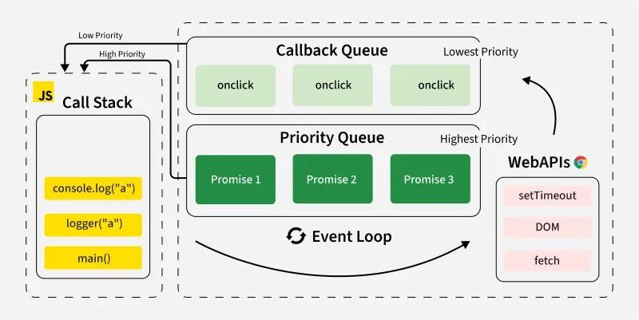

## Event Loop

- **Event-Loop**
    Is a mechanism that allows the JavaScript runtime to handle multiple tasks such as executing code, handling events, and performing asynchronous operations like fetching data or interacting with timers. It ensures that JavaScript remains non-blocking and asynchronous, despite being a single-threaded language.

### Screenshots

- ### How Event-Loop works ?
    
    - **Execute Synchronous Code:**
        - All synchronous code is executed first and placed in the call stack.

    - **Handle Asynchronous Tasks:**
        - Asynchronous operations like timers, I/O, or fetch are passed to Web APIs.
        - Once completed, their callbacks are queued for execution.

    - **Process Microtasks:**
        - Before handling tasks in the callback queue, the event loop processes all microtasks (like resolved promises).

    - **Execute Callback Queue:**
        - Once the microtasks are cleared, the event loop picks the next task from the callback queue and executes it.

- ### Key Concepts of Event Loop

    - **Call Stack:**
        - A stack where JavaScript keeps track of the execution of function calls.
        - Functions are pushed onto the stack when invoked and popped off once they return.

    - **Web APIs (or Background Tasks):**
        - Non-blocking operations like `setTimeout`, `fetch`, and DOM events are delegated to browser APIs (or Node.js equivalents like `fs` for file operations).
        - These tasks run independently of the main thread.
    
    - **Callback Queue (or Task Queue):**
        - When an asynchronous task (e.g., a timer or an event) is complete, its associated callback is placed in the queue, waiting to be executed.
        - These tasks are queued by `setTimeout`, `setInterval`, or other APIs.
    
    - **Microtask Queue:**
        - A special, high-priority queue for promises (`.then`, `.catch`, `.finally`) and MutationObserver callbacks.
        - Microtasks are executed before tasks in the regular callback queue.

    - **Event Loop:**
        - The event loop constantly checks if the call stack is empty.
        - If the call stack is empty, it pushes the next task from the microtask queue first (if any exist), followed by the callback queue, onto the call stack for execution.

- ### Types of Tasks in JavaScript

    - **Synchronous Tasks:**
        - Executed immediately on the call stack (e.g., function calls, variable declarations).

    - **Microtasks:**
        - High-priority asynchronous tasks, such as `Promise` callbacks and `queueMicrotask`.
        - Nesting Promises creates a queue of microtasks that execute in the same cycle.

    - **Macrotasks:**
        - Lower-priority asynchronous tasks, like `setTimeout`, `setInterval`, and DOM events.
        - Timers (`setTimeout) will always defer execution to the next event loop cycle, while microtasks resolve immediately after the current task.

- #### Conclusion:

    - **Order of Execution**
      - Execute all synchronous tasks on the call stack.
      - Process all microtasks in the microtask queue.
      - Process the first task in the macrotask queue.
      - Repeat.
